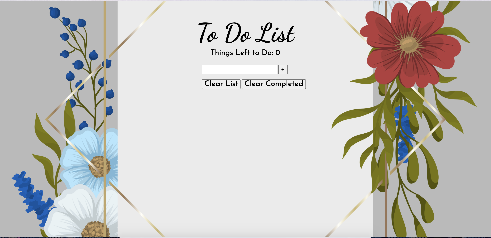

# To Do List
A simple to do list that with the options to mark and clear tasks.

**View project in browser:** https://dfdev-todolist.netlify.app/

## Design and Development
**Skills Used** HTML, CSS, JavaScript:
I built this to do list by breaking down its components and pseudo-coding what they would do (i.e., adding new tasks, crossing completed tasks, clearing the list, clearing the marked tasks). Doing so made it easier to translate into functions in JavaScript.

## Lessons Learned
In the beginning I started writing in JS by what I knew and after laying down the bulk of the foundation, I was able to optimize to achieve cleaner code. 
